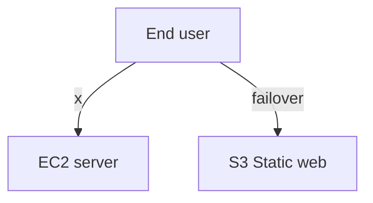

# 솔트웨어와 함께하는 AWS 101


## Architecture Diagram


## Compute
### EC2 인스턴스 생성하기

1. AWS Management Console에서 좌측 상단에 있는 **[Services]** 를 선택하고 검색창에서 EC2를 검색하거나 **[Compute]** 바로 밑에 있는 **[EC2]** 를 선택

2. EC2 Dashboard에서  **[Launch Instance]** 선택

3. AMI 선택창에서 **[Amazon Linux 2 AMI (HVM), SSD Volume Type]** 선택
	> AMI: Amazon Machine Image의 약자로 Virtual Machine (EC2 Instance) 생성에 필요한 정보가 명시되어 있는 템플릿으로 Operating System(Linux, Windows) 및 Software packages & libraries (Docker, MySQL,Python) 등이 미리 설치되어 있는 EBS Snapshot를 포함하고 있다

4. Instance Type 선택창에서 **[t2.micro]** 를 선택후, **[Next: Configure Instances Details]** 클릭
	> vCPU: A thread of a CPU core. 1 vCPU ≈ 0.5 CPU core.

5. Configure Instance Details 설정창에서 **[Advanced Details]** 옵션을 펼치고, **[User data]** 에 아래 스크립트를 넣어주고, **[Next: Add Storage]** 클릭
	```bash
	#!/bin/bash
	sudo yum install python3 mysql git -y
	```
	> Userdata:  EC2 Instance가 생성될때 Shell Script 또는 cloud-init 커맨드를 명시하여 환경설정 및 기타 소프트웨어 설치

6. Add Storage 설정창에서 **[Next: Add Tags] ** 클릭
	> Snapshot: Point in time backup of EBS volume. 예를 들자면 EBS volume을 만들고 그 안에 MySQL를 설치한 후 Snapshot을 만들고 이후 Python을 설치하고 어플리케이션을 다운받아서 실행했다고 가정했을때, 해당 Snapshot을 이용해서 EBS volume을 생성한다면 MySQL이 설치된 시점까지로 데이터가 새롭게 생성된 EBS volume에 복구 될것이다.

	> EBS vs Instance Store volume
	

	> [EBS volume types]([https://docs.aws.amazon.com/AWSEC2/latest/UserGuide/EBSVolumeTypes.html](https://docs.aws.amazon.com/AWSEC2/latest/UserGuide/EBSVolumeTypes.html))
	> * General Purpose SSD (gp2): 일반적인 Workload에 적합한 가성비를 가지고 있고 System Root Volume에 주로 이용
	> * Provisioned IOPS SSD (io1): 많은 I/O가 필요한 어플리케이션에 사용하며 주로 데이터베이스 Volume으로 쓰임
	> * Magnetic (standard): 일반적인 성능의 HDD
	> * Throughput Optimized HDD (st1): 자주 사용되면서 순간 처리량이 높은 데이터를 낮은 가격에 저장할때 쓰임(Big Data, Data Warehousing, 로그 분석)
	> * Cold HDD (sc1): 자주 사용되지 않는 데이터를 아주 저렴한 가격으로 저장할때 쓰임
7. Add Tags 설정창에서 **[Add Tag]** 를 클릭하고, **Key** = Name, **Value** = Web을 입력후, **[Next: Configure Security Group]** 클릭
	> Tag: Key-Value pair로 생성된 Resources(EC2, RDS, S3, etc)들을 구분, 검색 또는 그룹을 짓는데 이용
8. Configure Security Group 설정창에서 [Create a **new** security group]을 선택후, **Security group name**에 web-server-sg, **Description**에 Web server for aws 101 lab를 입력후,
	| Type | Protocol | Port Range | Source            | Description |   |
	|------|----------|------------|-------------------|-------------|---|
	| SSH  | TCP      | 22         | Custom, 0.0.0.0/0 |             | :negative_squared_cross_mark: |

	:negative_squared_cross_mark:를 클릭해서 해당 Rule를 삭제후, **[Review and Launch]** 클릭
9. Review Instance Launch 창에서 **[Launch]** 를 클릭후, Key pair 선택창에서 **Create a new key pair**를 선택, **Key pair name**에 awslab 입력후 **[Download Key Pair]** 를 눌러서 Private key(awslab.pem)를 다운로드 하고 **[Launch Instances]** 를 클릭

### Elastic IP 	생성하기
1. AWS Management Console - EC2 왼쪽 패널에서 NETWORK & SECURITY 섹션 아래에 있는 **Elastic IPs** 를 선택
2. **[Allocate new address]** 를 클릭후 **[Allocate]** 클릭
3. 새롭게 생성된 Elastic IP를 선택하고, **[Actions]** &rightarrow; **[Associate address]** 클릭
4. Instance 선택탭에서 Web를 선택 후 **[Associate]** 클릭
	> EC2 Instance에 자동으로 부여된 Public IP 주소는 해당 EC2가 정지되는 순간 자동으로 Release 되고 다시 시작될때 새로운 Public IP를 할당 받음. 고정적은 Public IP가 필요하면 Elastic IP를 할당받아서 EC2에 붙여주어야 함
	> 어 그럼 정지 안하면 되는거 아닐까요??
### EC2 Instance에 SSH 접속하기
- Mac 또는 Linux의 경우
	- SSH Private Key (.pem file) 권한변경
		```bash
		chmod 400 awslab.pem
    ```
	- SSH 연결
		```bash
		ssh -i awslab.pem ec2-user@<EC2 Instance Public IP>
    ```
- Windows 경우
	- Putty 설정
- SSH 접속이 되지 않을 경우 EC2 Instance에 붙어있는 Security Group에 SSH Protocol에 대해 해당 사용자가 접속된 IP로 부터 연결이 허가 되어있는지 확인.
	AWS Manangement Console에서 Web 인스턴스를 선택하고 화면 아래에 나오는 Description탭에 있는 Security groups에 있는 **[view inbound rules]** 눌러서 22 포트가 사용자 접속 아이피 또는 	0.0.0.0/0 (모든 IP)로 부터의 inbound traffic을 허가 했는지 확인하고, 없을경우 Inbound rule을 추가해주어야 함
	1. **web-server-sg**를 클릭해서 해당 Security group설정창으로 이동
	2. 화면 아래에 나오는 **[Inbound]** 를 클릭 &rightarrow; **[Edit]** 클릭후, **Type** = SSH를 선택 **Source** = My IP를 선택, **Description** = Saltware를 입력하고 **[Save]**
	> Security Group은 EC2 Instance의 방화벽(Firewall)이고 기본값으로 모든 포트에 대한 접속이 Deny 되어 있고 Inbound 또는 Outbouce Rule을 추가해서 특정 포트(또는 특정 포트 범위)에 대해서 특정 IP(또는 특정 IP 범위)에서의 접속을 Allow 할수 있다.

### Web Application 실행하기
1. Clone a git repository
	```bash
	git clone https://github.com/woowhoo/aws101.git && cd aws101
  ```
2. Python Package 설치
	```bash
	sudo pip3 install -r requirements.txt
  ```
3. Application 실행
	```bash
	sudo python3 form.py
  ```
4. 웹브라우저에서 EC2 Instance Public IP로 접속. 접속 실패시 Security Group에서 HTTP에 대한 Inbound Rule이 있는지 확인후 없으면 추가.

## Database
### RDS Instance 생성하기
1. AWS Management Console에서 좌측 상단에 있는 **[Services]** 를 선택하고 검색창에서 RDS를 검색하거나 **[Database]** 바로 밑에 있는 **[RDS]** 를 선택

2. RDS Dashboard에서  **[Create database]** 클릭후,
	**Choose a database creation method** = Standard Create,
	**Engine options** = MySQL,
	**Version** = 5.7.26,
	**Templates** = Dev/Test,
	**DB instance identifier**  = awslab,
	**Master username** = admin,
	**Auto generate a password** = :white_check_mark:,
	**DB instance size** = Burstable classes - db.t2.micro,
	**Storasge type** = General Purpose (SSD),
	**Allocated storage** = 20,
	**Enable storage autoscaling** =  :white_check_mark:,
	**Maximum storage threshold** = 1000,
	**Multi-AZ Deployment** = Create a standby instance,
	**Virtual Private Cloud** = Default VPC,
	Expend **[Additional connectivity configuration]**,
	**Subnet group** = default,
	**Publicly accessible** = No,
	**VPC security group** = Create new,
	**New VPC security group name** = rds-mysql-sg,
	**[Create database]** 클릭
3. 화면 상단의 파랑색 안내창에서 **[View credential details]** 클릭하여 Master password 확인 (메모해주세요)
### Multi-AZ failover
1. RDS Instance 목록에서 **awslab**의 **Region & AZ**을 확인한다.
2. **awslab** RDS Instance를 선택 후 **[Actions]** &rightarrow; **[Reboot]**, Reboot With Failover = :white_check_mark:, &rightarrow; **[Reboot]** 클릭
3. Reboot 완료후 **Region & AZ** 값이 바꿘것을 확인할수 있다.
### MySQL Database 설정
1. MySQL database로 접속
	EC2 Instance에서 `mysql -h <RDS_ENDPOINT> -u admin -p` 커맨드 실행후
	`Enter password:` 에 위에 Master password 입력. 접속 실패시 Security Group에서 MySQL(Port 3306)에 대한 Inbound Rule이 있는지 확인후 없으면 추가.
	> 동일한 VPC에 있는 Instances(EC2, RDS, ElastiCache, etc)간 통신은 Security group의 Inbound rule에 있는 Sources를 접속을 허가할 Instance가 가지고 있는 Security group으로 지정 가능.
2. RDS Dashboard에서 **awslab**를 선택하고, Security 탭에 있는  **rds-mysql-sg**를 클릭해서 해당 Security group설정창으로 이동
3.  화면 아래에 나오는  **[Inbound]**  를 클릭   **[Edit]** &rightarrow; **[Add Rule]** 클릭,  **Type**  = MYSQL/Aurora를 선택  **Source**  = Custom 옆에 있는 Textfield에 web-server를 입력후 Dropdown List에 나오는 web-server-sg를 선택,  **Description**  = Web를 입력하고  **[Save]**
4. 1번에 있는 Command로 다시 MySQL에 접속
5. Database 생성
	```sql
	CREATE DATABASE form;
6. Database User 생성
	```sql
	CREATE USER form_user IDENTIFIED BY 'asdf1234';
  ```
7. Database User에 권한 부여
	```sql
	GRANT ALL PRIVILEGES ON form.* TO form_user;
  ```
8. Database 변경
	```sql
	USE form;
  ```
10. Table 생성
	```sql
	CREATE TABLE IF NOT EXISTS users (
		id INT AUTO_INCREMENT,
		name VARCHAR(255) NOT NULL,
		email VARCHAR(255) NOT NULL,
		password VARCHAR(35) NOT NULL,
		attachment VARCHAR(255),
		PRIMARY KEY (id)
	);
  ```
### Application 설정 파일 업데이트
1. Text editer(vim or nano)로 config.py 파일을 열고 **DB_HOST** = <RDS_ENDPOINT>, **DB_NAME** = form, **DB_USER** = form_user, **DB_USERPASSWORD** = asdf1234로 변경
2. Web Application을 재실행
	```bash
	sudo python3 form.py
  ```
4. 웹브라우저에서 EC2 Instance Public IP로 접속후 Form 작성 후 **[Sign Up]**
	*Attachment에 파일은 첨부하지 않습니다.
5. 완료후 IP주소 끝에 `/admin` 넣고 페이지를 불러오면 방금 입력한 form에 대한 정보를 볼수 있습니다.
## Storage
### S3 Bucket 만들기
1. AWS Management Console에서 좌측 상단에 있는 **[Services]** 를 선택하고 검색창에서 S3를 검색하거나 **[Storage]** 바로 밑에 있는 **[S3]** 를 선택
2. S3 Dashboard에서  **[Create bucket]** 클릭후, **Bucket name** = awslab-s3-[임의의 문자 및 숫자], **Region** = Asia Pacific (Seoul), **[Create]** 클릭
### S3 101
1. [Versioning]([https://docs.aws.amazon.com/AmazonS3/latest/dev/ObjectVersioning.html](https://docs.aws.amazon.com/AmazonS3/latest/dev/ObjectVersioning.html)): 동일한 Key의 파일을 업로드 했을때 기존의 파일을 Overwrite 하지 않고 새로운 Version을 생성하고 해당 Key는 새로운 버전을 Point한다. 해당 파일에 Delete 명령이 내려질 경우, 실제로 파일을 지우지 않고 Delete Marker를 만들어 Key는 Delete Marker를 Point해서 해당 파일이 없는거 같은 효과를 낸다.
2. Server access logging: 해당 S3 Bucket 또는 Objects에 대한 Access (GET, PUT, DELETE, LIST, etc)에 대한 로그 생성.
	[Log format]([https://docs.aws.amazon.com/AmazonS3/latest/dev/LogFormat.html](https://docs.aws.amazon.com/AmazonS3/latest/dev/LogFormat.html))
3. Static website hosting: HTML, CSS, Javascript + 기타 Image 또는 Text 파일들로 구성된 동적 웹사이트 호스팅
4. Encryption: AWS-managed key 또는 사용자가 지정한 KMS key로 objects 암호화
5. Events: PUT, POST, DELETE 등의 S3 event가 발생했을때 SNS, SQS 또는 Lambda로 해당 이벤트 내용을 전달하여 Notification을 발송하거나 추가적인 Action를 취함.
	e.g. Image resizing, Create image metadata, Monitoring critical objects
6. Lifecycle: Object 생성후 특정 시간후에 Storage class를 변경하거나 삭제.
7. Cross-region replication: 전체 Bucket, 특정 prefix 또는 Tag를 다른 Region에 있는 Bucket으로 복제. 보통 백업용도로 사용하고 Global 사용자들에게 low-latency로 서비스를 원할경우 CloudFront 사용을 권장.
### Application 설정 파일 업데이트
1. Text editer(vim or nano)로 config.py 파일을 열고 **S3_BUCKET** = <S3_BUCKET_NAME> 으로 변경
2. Web Application을 재실행
	```bash
	sudo python3 form.py
  ```
4. 웹브라우저에서 EC2 Instance Public IP로 접속후 Form 작성, Attachment에 파일을 추가하고  **[Sign Up]**
5. **botocore.exceptions.NoCredentialsError: Unable to locate credentials** 에러가 발생. AWS credentials를 찾을수 없을때 발생하는 에러
### IAM Role 생성
1. AWS Management Console에서 좌측 상단에 있는 **[Services]** 를 선택하고 검색창에서 IAM를 검색하거나 **[Security, Identity, & Compliance]** 바로 밑에 있는 **[IAM]** 를 선택
2. IAM Dashboard에서  **[Roles]** 클릭후, **[Create role]** 클릭
3. **Choose the service that will use this role**에 EC2를 선택 &rightarrow; **[Next: Permissions]** &rightarrow; **[Next: Tags]** &rightarrow; **[Next: Review]**
4. **Role name** = awslab-ec2-role, **[Create Role]** 클릭
5. 다시 EC2 Dashboard로 돌아가서 Web 인스턴스를 선택후 **[Actions]** &rightarrow; **[Instance Settings]** &rightarrow; **[Attach/Replace IAM Role]** 클릭
6. **IAM role**에 방금 만든 awslab-ec2-role를 선택후 **[Apply]** 클릭
7. Web UI에서 새로운 Form 작성, Attachment에 파일을 추가하고  **[Sign Up]**
8. **botocore.exceptions.ClientError: An error occurred (AccessDenied) when calling the PutObject operation: Access Denied** 에러발생. AWS Credentials에 해당 S3 Bucket에 대한 PutObject 권한이 없어서 발생하는 에러
	> IAM Role: AWS 서비스들에 대한 권한을 명시한 IAM Policy를 포함할수 있는 IAM Identity의 일종으로 IAM User, IAM Group에 귀속되거나 여타 AWS 서비스들에 (EC2, Lambda, etc) 부여되여 AWS services 대한 권한 관리
### IAM Policy 생성
1. AWS Manangement Console에서 Web 인스턴스를 선택하고 화면 아래에 나오는 Description탭의 IAM role에 있는 **[awslab-ec2-role]** 클릭
2. **[:heavy_plus_sign: Add inline policy]** 클릭후,
	**Service** = S3,
	**Actions** = All S3 actions(s3:*),
	**Resources** = [
			bucket = **[Add ARN]** &rightarrow; Bucket name에 위에서 만든 S3 Bucket 이름 입력  &rightarrow;  **[Add]**
			object = **[Add ARN]** &rightarrow; Bucket name에 위에서 만든 S3 Bucket 이름 입력, Object name에 *또는 :white_check_mark: Any  &rightarrow;  **[Add]**
3. **[Review Policy]** &rightarrow; **Name** = awslab-s3-full-access &rightarrow; **[Create Policy]**
4. Web UI에서 새로운 Form 작성, Attachment에 파일을 추가하고 **[Sign Up]**
5. Admin Page "/admin" 로 이동 &rightarrow; Attachment에 있는 URL를 이용해서 파일 다운로드
6. AccessDenied 에러 발생
### S3 object에 public access 권한 부여
- Object-level access control
	1. S3 Dashboard로 이동후 해당 Bucket 클릭
	2. 해당 파일을 선택 &rightarrow; **[Actions]** &rightarrow; **[Make public]**
		***[Make public]** 이 비활성화 되어있을 경우, **[Permissions]** &rightarrow; **[Block public access]** &rightarrow; **[Edit]** &rightarrow;  uncheck **Block _all_ public access** &rightarrow; **[Save]**

- Bucket-level access control
	1.  Web UI에서 새로운 Form 작성, Attachment에 파일을 추가하고  **[Sign Up]**
	2.  Attachment에 있는 URL를 이용해서 파일 다운로드
	3.  AccessDenied 에러 발생
	4. S3 Dashboard로 이동후 해당 Bucket 클릭
	5. **[Permissions]** &rightarrow; **[Bucket Policy]** &rightarrow; 아래 Policy 블록을 Bucket policy editor에 붙여놓고 **[Save]**
		```json
		{
			"Version":"2012-10-17",
			"Statement":[
				{
					"Sid":"AddPerm",
					"Effect":"Allow",
					"Principal": "*",
					"Action":["s3:GetObject"],
					"Resource":["arn:aws:s3:::<BUCKET_NAME>/*"]
				}
			]
		}
    ```
	6. 파일 다운로드 재시도
- Presigned URL
	1. Text editer(vim or nano)로 config.py 파일을 열고 **PRESIGNED_URL** = True로 변경
	2. Web Application을 재실행
		```bash
		sudo python3 form.py
    ```
	3. Attachment에 있는 URL를 이용해서 파일 다운로드
	> Presigned URL: 임시로 만들어진 URL를 통해서 S3 Object (Key) 에 대한 GET or PUT 권한 부여

## Application Services & Monitoring
### IAM User 생성
1. AWS Management Console에서 좌측 상단에 있는 **[Services]** 를 선택하고 검색창에서 IAM를 검색하거나 **[Security, Identity, & Compliance]** 바로 밑에 있는 **[IAM]** 를 선택
2. IAM Dashboard에서  **[Users]** 클릭후, **[Add user]** 클릭,
	**User name*** = <본인이 원하는 아이디>,
	**Access type*** = :white_check_mark: AWS Management Console access,
	**Console password*** = Custom password 선택후 비밀번호 입력,
	**Require password reset** = uncheck,
	**[Next: Permissions]**
3. **[Attach existing policies directly]** &rightarrow; :white_check_mark: AdministratorAccess &rightarrow; **[Next: Tags]** &rightarrow; **[Next: Review]** &rightarrow; **[Create user]**
4. AWS Management Console sign-in URL를 메모
### Switch Role
0. 웹브라우저의 Private mode나 Incognito mode 윈도우로 접속시 진행이 더 쉽습니다
1. 이전 섹션에서 메모해둔 AWS Management Console sign-in URL로 접속
2. 화면 우측상단 :bell: 오른쪽에 있는 ***username @ 1234-5678-9012*** 형식의 탭을 클릭 &rightarrow; **[Switch Role]**
3. **[Switch Role]**  &rightarrow; **Account*** = 491818659652, **Role*** = awslab_crossaccount_role 을 입력후 **[Switch Role]**

### Web server에 도메인 연결
1. AWS Management Console에서 좌측 상단에 있는 **[Services]** 를 선택하고 검색창에서 Route53를 검색하거나 **[Networking & Content Delivery]** 밑에 있는 **[Route53]** 를 선택
2. **[Hosted zones]** &rightarrow; **saltware.io.** &rightarrow; **[Create Record Set]** &rightarrow; **Name** = <본인의 이니셜>, **Type** = A - IPv4 address, **Alias** = No, **TTL** = 30, **Value** = <EC2_PUBLIC_IP>, **Routing Policy** = Simple

###  Webserver 상태 체크 생성
1. Route53 Dashboard에서 **[Health checks]**  &rightarrow; **[Create health check]** &rightarrow; **Name** = <도메인주소> i.e. woo.saltware.io, **IP address** = <EC2_PUBLIC_IP> 입력 후 **[Next]**
2. **Create alarm** = Yes, **Send notification to** = New SNS topic, **Topic name*** = [Subdomain]_route53_health, **Recipient email addresses** = [Your email address] &rightarrow; **[Create health check]**
3. AWS Notification - Subscription Confirmation 메일 수신후 Confirm
4. Python Web App을 정지하고 Email Notification이 오는지 확인

### 점검중 페이지 만들기
1. AWS Management Console에서 좌측 상단에 있는 **[Services]** 를 선택하고 검색창에서 S3를 검색하거나 **[Storage]** 바로 밑에 있는 **[S3]** 를 선택
2. S3 Dashboard에서  **[Create bucket]** 클릭후,
	**Bucket name** = [DOMAIN_NAME] i.e. woo.saltware.io,
	**Region** = Asia Pacific (Seoul),
	**[Create]** 클릭
3. **maintenance.html** 파일 업로드
4. **[Properties]** &rightarrow; **[Static website hosting]** &rightarrow; **Use this bucket to host a website** &rightarrow; **Index document** = maintenance.html &rightarrow; **[Save]**
5. ACL 또는 Bucket Policy를 활용해서 해당 Bucket에 Public access 부여
### Failover 라우팅 설정

1. Route53 Dashboard에서 **[Hosted zones]** &rightarrow; **saltware.io** &rightarrow; 기존에 만든 Record Set 선택 &rightarrow; **Routing Policy** = Failover, **Failover Record Type** = Primary, **Associate with Health Check** = Yes, **Health Check to Associate** = 해당 도메인 네임 선택후 **[Save Record Set]**
2. **[Create Record Set]**  &rightarrow; **Name** =<기존에 만든것과 동일하게 입력>, **Type** = A - IPv4 address, **Alias** = Yes,  **Alias Target** = s3-website.ap-northeast-2.amazonaws.com, **Routing Policy** = Failover, **Failover Record Type** = Secondary, **Evaluate Target Health** = No, **Associate with Health Check** = No
3. Python Web App을 정지하고 Email Notification이 오면 점검중 페이지가 표시되는지 확인
## Clean up
1. EC2 Instance 삭제
2. Elastic IP 삭제
3. RDS Instance 삭제
4. S3 Bucket 삭제(2개)
